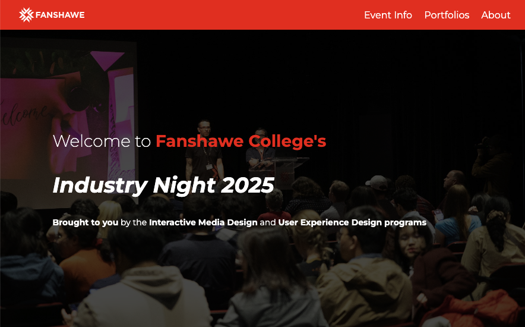

# Hackathon Student Showcase

This is a repo for the Hackathon Student Showcase project. This project is part of the Interactive Media Design program and involves building a mobile-first, responsive website for the upcoming Industry Night event. The site will showcase student portfolios, testimonials, and information about the event.

## Installation

There is no installation required.

## Usage

Open index.html in the browser of your choice.

## Contributing

1. Fork it!
2. Create your feature branch: `git checkout -b my-new-feature`
3. Commit your changes: `git commit -am 'Add some feature'`
4. Push to the branch: `git push origin my-new-feature`
5. Submit a pull request :D

## History

September 26th 2024

## Credits

**Thi Thanh Thuong Nguyen (Anna)** 
**Ali El-Maniary (Leo)** 
**Nikolai Meijer** 
**Gia Khang Ho (Eric)** 

## License

MIT - please see license file.
